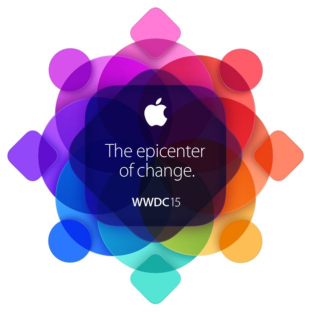

 * [Conference](#conference)
   * [Tips](#tips)
   * [Keynote](#keynote)
   * [Developer](#developer)
   * [Tools](#tools)
   * [Swag](#swag)
 * [Events](#events) 
   * [Parallel Conferences](#parallel-conferences)
   * [Party](#party)
   * [Pure Fun](#pure-fun)
 * [San Francisco](#san-francisco)
   * [Visit](#visit)
   * [Drink](#drink)
   * [Eat](#eat)
   * [Sleep](#sleep)
   * [Travel](#travel)
 * [Community](#community)
   * [Talk](#talk)
   * [Listen](#listen)

  

# Conference
❕No selfie sticks   
❕Lectures this year strech all the way to friday

[MacRumors WWDC Roundup](http://www.macrumors.com/roundup/wwdc/) – Updated with the latest info

### Tips
 - **Carry a business card**.   
Apple employees wont give you theirs, but will accept yours
 - **Labs are for rockstars, come early to register your slot**.
 - **Speed up your check-in**.   
Apple emailed you a personal Passbook for faster check-in at Moscone West. You can check in early on Sunday, June 7 from 9:00 a.m. to 7:00 p.m. PDT.

 - **Download the WWDC app**.   
[Get the app](https://itunes.apple.com/us/app/wwdc/id640199958?mt=8) to mark your favorite special events, lunchtime speakers, and Get Togethers. After the keynote you’ll be able to view the full schedule and get access to news updates, session videos, and more throughout the week.
 - **Bring all your gear**.   
Make sure to pack your Mac with the latest developer tools installed, iOS devices for testing, and essential peripherals like power and Ethernet adapters.
 - **Sandwiches are delivered during launch time**.
   - They are usually meh at best. Lactose-intolerant sandwiches taste better.

### Keynote

Keynote is the opening highlight of the conference. Usually a line begins to form starting at 6am to get good seats. If you prefer the chillback apporach, arrive at 8:30, to amend the popularity there is a second stadium with live video. AltConf has a [standstanding-room](http://www.joecieplinski.com/blog/2015/03/30/release-notes-joins-forces-with-altconf/) live stream as well.

 - Come early if you want to get good seats close to the stage.
   - Bring a chair with you to sit through the line. Make it foldable for extra "the guards won't throw it away" points.
   - Waiting the line is an adventure and you should treat it as such, you will meet amazing people and optionally form life lasting friendships.
   - Come in a group. Makes taking coffee trips much easier.
 - Wi-Fi usually dies during the keynote due to high demand, no work arounds. Be prepared.
   - Do not use [MiFi](https://www.youtube.com/watch?v=znxQOPFg2mo)

### Developer
 - Bring a secondary device for iOS 9 hacking
 - First floor has a network CDN to download the new release

### Tools
 - [ASCIIwwdc](http://asciiwwdc.com/) – Searchable full-text transcripts of WWDC sessions
 - [WWDC](https://github.com/insidegui/WWDC) – Watch WWDC sessions on your Mac.
 - [Passbook Business Card](http://www.myuiviews.com/2014/06/01/step-by-step-create-a-passbook-business-card.html) - Geekout on exploiting Apple's Passbook app to distribute your developer based business card.

### Swag
 - [Company Store](https://www.apple.com/companystore/) is open speacial hours during WWDC. 
   - June 7, 12:00 p.m. to 5:30 p.m.
   - June 8-12, 10:00 a.m. to 5:30 p.m.
 - There is a mini store in Moscone during the conference, carrying less items but saves you the 1 h trip.
 
 
# Events 

Mingle and talk to as many people as you can, all through the conference.

### Parallel Conferences
 - [AltConf](http://altconf.com/) – The original alternative to WWDC
 - [Layers](http://bringyourlayers.com/) – A conference about design

### Party
 - [Parties for WWDC](https://itunes.apple.com/us/app/parties-for-wwdc/id879924066?mt=8) – an app to help you find out what’s going on during WWDC
 - [WWDC Parties](https://2015.wwdcparties.com) – Aggreated list of WWDC focued events, filted by alcohol, food, meetup, presentation and outdoors.
 - [@WWDCParties](https://twitter.com/WWDCParties) – Twitter feed of WWDC Parties website, listing all the recent hot stuff as they are announced.

### Pure Fun
 - [WWDC Hike](http://wwdchike.com) - June 7th, 2015, the Sunday before WWDC. We'll leave at 2pm.

# San Francisco

*Could use some help here guys..*

### Visit
 - 2066 Crist Drive, Los Altos, California (?)
 - [Emperor Norton's Fantastic San Francisco Time Machine](http://www.emperornortontour.com) - a fun walking tour if you're interested in San Francisco history.
 - Chinatown is fun to walk around in and there's lots of good food.
 - [Musee Mecanique](http://museemecaniquesf.com) in Fisherman's Wharf is a free museum with lots of old arcade machines.
 - [Free Gold Watch](http://uptownalmanac.com/2013/07/free-gold-watch-best-place-san-francisco-where-no-one-goes-yet) in Haight-Ashbury is the best place to play pinball in SF.
 - Golden Gate Park is a short MUNI ride away with attractions like California Academy of Science, De Young Museum, and Botanical Gardens

### Drink
 - [The Chieftain](http://www.thechieftain.com) bar is a popular watering hole during WWDC festivities. *198 5th St, San Francisco*
 - After keynotes at Moscone Center, you can often bump into off-duty Apple employees minglingat the [W Hotel bar](http://www.wsanfrancisco.com) just across the street. *181 3rd St, San Francisco*
 - House of Shields, on New Montgomery Street across from the Palace Hotel
 - [Thirsty Bear](http://thirstybear.com) is popular for beer & tapas.
 - [21st Amendment](http://21st-amendment.com) is another popular brewpub restaurant.
 
### Eat
 - [Cafe Chaat](http://www.cafechaatsanfrancisco.com) Good Indian food a block from Moscone
 - Osha Thai - Thai food a block from Moscone
 - [Canton Dim Sum](http://www.cantonsf.com) Chinese restaurant on Folsom St.
 - [Tommy's Joynt](http://www.tommysjoynt.com) - a San Francisco tradition.
 - [San Tung](http://santungchineserestaurant.com) a bit out of the way, but worth the trip for the best wings.

### Sleep 
 - [Hotel Tonight](https://itunes.apple.com/us/app/hotel-tonight-last-minute/id407690035?mt=8)
 - [Airbnb](https://itunes.apple.com/us/app/airbnb/id401626263?mt=8)
 
### Travel
 - Muir Woods is a great place to hike if you want to get out of the city for a little while.
 - Yosemitie is beautiful for a weekend, and only 4 h by car.

# Community

### Talk
 - [Core Intuition Slack #wwdc channel](http://chat.coreint.org)
 - [iOS Developers Slack #wwdc15 channel](http://ios-developers.io)
 - [WWDC 2015 Slack](https://polar-refuge-3698.herokuapp.com)

### Listen
 - [Release Notes - 105 Our Annual WWDC Tips](http://releasenotes.tv/105-our-annual-wwdc-tips/)
 
# 🚀
 - [@JonyIveParody](https://twitter.com/JonyIveParody) - Apple, from not Jony Fucking Ive's PoV
 - [@Horse_iOS](https://twitter.com/horse_ios) - Yes, that's are real person
 - [@_HairForceOne](https://twitter.com/_hairforceone) - Craig Federighi. Most definitely Parody.
